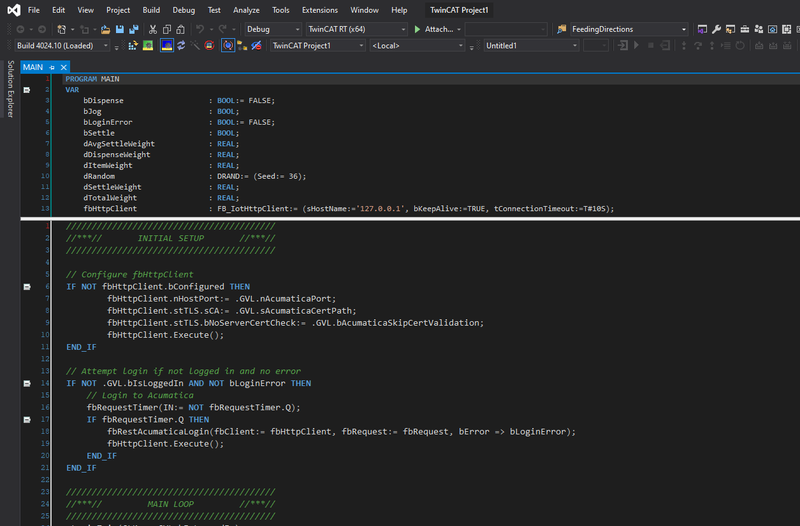

# TwinCATDarkMode

> :warning: I am not responsible for anything that happens as a result of you **following** OR ***not following*** the instructions below!

> The upper editor in online view remains white. There are reports of unexplained VS crashes, possibly due to changes made here. See the warning above!

## Instructions

1. Get the files
    1. Download the ``TwinCAT.zip`` file and extract *somewhere*
    1. Close any running instances of Visual Studio
    1. Copy the ``TwinCAT`` folder that is extracted and paste into the parent folder of your TwinCAT installation directory. For example, if TwinCAT is installed in ``C:\``, copy the extracted ``TwinCAT`` folder to ``C:\``.  This will cause Windows to ask if you would like to replace several files. Click **Replace the files in the destination**. This will also copy backup files, so you should not need to backup, but if you don't, see the warning at the top of this page.
1. Import the settings (will only affect a couple TwinCAT options)
    1. Download the ``darkModeColors.vssettings`` file to *somewhere*
    1. Start Visual Studio
    1. Open the ``Tools`` > ``Import and Export Settings...`` menu
    1. Select the **Import selected environment settings** and click *Next*
    1. Import settings 
        - Choose to save your current settings **OR**
        -   choose not to save your current settings (see warning at top of page)
        - Click *Next*
    1. Click *Browse*
    1. Find and open the ``darkModeColors.vssettings`` file you downloaded and click *Next*
    1. Click *Finish*

## Preview

